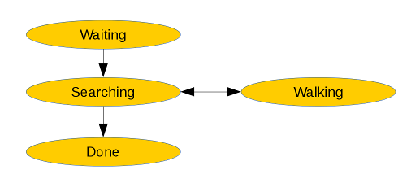

Logic
=====

To control the robots behaviour we use a simple state machine and command queue.

Depending on the state, the robot uses different sensor input.
In waiting state, the robot waits for a verbal command. Once the command is given
the robot gets into the searching state, in which a scanning routine is used.
the robot looks around and looks for the target given in the verbal command.
If a target is found, the robot moves towards it in set number of steps.
after each step it checks again if it still sees the target. if not, the scanning
routine is started again. this continues until the robot reaches the target. It then
gets into the done state, at which point it clears the command queue and moves to the
resting position.
